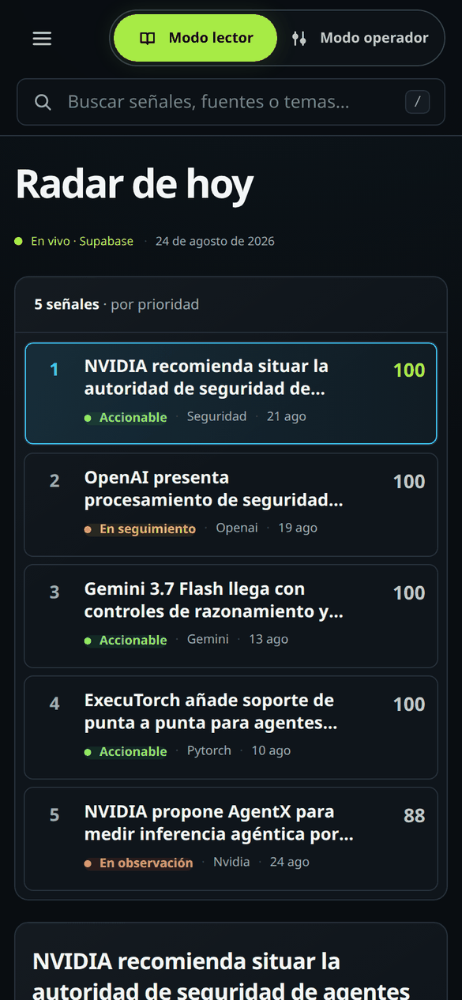
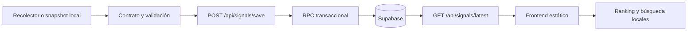

# AI Radar

AI Radar convierte novedades de inteligencia artificial en señales accionables
para builders. El producto organiza fuentes, evidencia, impacto, confianza y
acción sugerida en un radar que ayuda a decidir qué merece atención y qué vale
la pena probar.

> AI Radar recopila, valida, clasifica y prioriza novedades de inteligencia
> artificial para convertir información dispersa en señales accionables
> respaldadas por fuentes.


## Estado del proyecto

AI Radar tiene una demo funcional en construcción, con frontend estático,
contrato de datos versionado, API server-side y persistencia inicial en
Supabase. Esta rama corresponde a la preparación del proyecto para portafolio;
las capacidades que todavía no existen se mantienen visibles en la sección de
pendientes.

## Qué problema resuelve

El ritmo de la inteligencia artificial produce ruido: el mismo lanzamiento
aparece en varias fuentes, una demo puede no tener evidencia suficiente y los
repositorios útiles compiten con anuncios sin impacto práctico. AI Radar
estructura cada novedad para responder:

1. ¿Qué ocurrió?
2. ¿Por qué importa?
3. ¿Qué evidencia lo respalda?
4. ¿Qué tan confiable es?
5. ¿Qué acción se recomienda realizar?

## Qué funciona hoy

- Dashboard de lectura con ranking, búsqueda, detalle, evidencia, fuentes,
  estados de carga, error, ausencia de datos y reintento.
- Fallback de demostración con el snapshot local versionado cuando
  `GET /api/signals/latest` no responde, no tiene runs o no cumple el
  contrato. La interfaz distingue de forma visible entre datos de Supabase en
  vivo y datos de demostración.
- Modo operador local para ajustar temporalmente el ranking y preparar una
  edición de título, acción y estado. La interfaz informa que estos cambios no
  se persisten.
- Contrato JSON para snapshots diarios en
  [`contracts/ai-radar-signal.schema.json`](contracts/ai-radar-signal.schema.json).
- Endpoint `GET /api/signals/latest` que reconstruye el snapshot más reciente
  desde Supabase sin exponer credenciales.
- Endpoint `POST /api/signals/save` con validación, autorización e idempotencia
  mediante una función RPC de Supabase.
- Recolector determinista para The Batch y snapshots locales de prueba.
- Pruebas unitarias, de integración de API y E2E con verificación básica de
  accesibilidad.

## Demo y evidencia visual

- [Demo desplegada en Vercel](https://ai-radar-ten-omega.vercel.app/)
- [Estado y límites del despliegue](docs/despliegue-vercel.md)

La URL pública se verificó el 24 de agosto de 2026. El frontend y
`GET /api/signals/latest` responden sin configuración adicional; este último
entrega el snapshot en vivo más reciente desde Supabase. El fallback demo
permanece disponible para fallos temporales y se identifica visualmente.
Consulta el registro de despliegue en
[`docs/despliegue-vercel.md`](docs/despliegue-vercel.md). La grabación de
recorrido de la demo se guarda fuera de control de versiones en `recordings/`;
las capturas de esta sección sí están versionadas en `docs/img/`.

### Modo operador

Las acciones de revisión se aplican sobre la señal seleccionada y solo aparecen
con el modo activo. Los cambios son locales a la sesión y la interfaz lo declara.


### Móvil



## Arquitectura



El flujo principal es:

```text
recolección → normalización del snapshot → validación → persistencia → lectura
→ ranking local → visualización
```

La explicación detallada está en [`docs/ARCHITECTURE.md`](docs/ARCHITECTURE.md).

## Ranking

El ranking actual es determinista y se calcula en el navegador a partir del
snapshot recibido. Suma puntos por estado, confianza, completitud de evidencia,
impacto y acción, además de etiquetas, con un máximo de 100. En caso de empate
usa la fecha de publicación y luego el identificador de la señal.

El puntaje es una ayuda editorial local, no una puntuación persistida ni un
modelo de relevancia entrenado. El modo operador permite un ajuste temporal de
entre -10 y +10 puntos para la sesión actual.

## Stack y decisiones

- Frontend: HTML, CSS y JavaScript sin bundler.
- Dominio: módulos ES reutilizables para carga, contrato y ranking.
- API: Vercel Functions en `api/`.
- Persistencia: Supabase vía PostgREST y RPC.
- Automatización local: scripts Node.js y Python.
- QA: `node:test`, Playwright y axe-core.
- Contrato: JSON Schema más validación defensiva en los límites de la API y
  del frontend.

Se eligió una superficie pequeña para que el contrato, la seguridad y el flujo
de datos sean fáciles de revisar antes de agregar framework o infraestructura
adicional.

## Instalación y uso local

Requisitos: Node.js compatible con el proyecto y Python 3 para los scripts de
consulta o guardado.

```bash
npm ci
npm run test:all
npm run dev
```

La interfaz queda disponible en `http://127.0.0.1:4173`. Las pruebas E2E
interceptan `GET /api/signals/latest`, por lo que no necesitan credenciales
reales de Supabase.

### Variables de entorno

Copia `.env.example` y completa los secretos solo en el entorno donde se
ejecute la API:

- `SUPABASE_URL`
- `SUPABASE_SECRET_KEY` (recomendada)
- `SUPABASE_SERVICE_ROLE_KEY` (compatibilidad legacy)
- `AIRADAR_WRITE_TOKEN`
- `AIRADAR_SAVE_ENDPOINT` para el script de guardado

Las claves privadas son server-side. No deben comenzar con `NEXT_PUBLIC_`,
entrar al frontend ni committearse.

## Scripts principales

| Comando | Propósito |
| --- | --- |
| `npm run dev` | Sirve la interfaz estática localmente. |
| `npm test` | Ejecuta pruebas unitarias y de API. |
| `npm run test:e2e` | Ejecuta el recorrido E2E con Playwright. |
| `npm run test:all` | Ejecuta las suites unitarias y E2E. |
| `npm run collect:the-batch` | Lee y evalúa la portada de The Batch. |
| `npm run save:production -- data/daily/2026-08-24.json` | Guarda un snapshot usando el flujo OIDC temporal de Vercel. |

Para consultar snapshots locales:

```bash
python3 scripts/consultar_senales.py --dia 2026-08-24 --cantidad 5 --orden impacto
```

La persistencia y sus variables están documentadas en
[`docs/DATABASE.md`](docs/DATABASE.md) y [`docs/persistencia-supabase.md`](docs/persistencia-supabase.md).

## API y datos

- [Contrato de snapshots](contracts/ai-radar-signal.schema.json)
- [Documentación de API](docs/API.md)
- [Arquitectura y flujo](docs/ARCHITECTURE.md)
- [Modelo de datos y persistencia](docs/DATABASE.md)

Un snapshot contiene `contract_version`, fecha, parámetros de búsqueda y al
menos una señal. Cada señal requiere título, fuente HTTP(S), evidencia,
impacto, acción y estado; confianza y etiquetas son opcionales.

## Seguridad

- Las claves de Supabase solo se leen en las funciones server-side.
- Las tablas tienen RLS habilitado y no conceden acceso público a `anon` ni
  `authenticated`.
- La escritura exige `Authorization: Bearer ...` y acepta un token estático
  configurado o un token OIDC de Vercel validado contra equipo, proyecto,
  entorno y usuario.
- La respuesta pública nunca incluye credenciales ni detalles internos del
  error de Supabase.
- Vercel añade Content Security Policy, `nosniff`, política de referrer y
  permisos de navegador restringidos.

## Decisiones y aprendizajes

- La validación ocurre en los límites porque un snapshot local, una API y una
  base de datos pueden recibir datos en momentos distintos.
- La persistencia se concentra en una RPC para que un run y sus señales no se
  guarden como operaciones independientes.
- El modo operador declara sus límites en la interfaz: todavía es una sesión
  local, no un sistema editorial multiusuario.
- La primera fuente automatizada usa `__NEXT_DATA__` estructurado y fixtures
  para detectar cambios de la portada sin depender de selectores visuales.
- La demo usa un snapshot local versionado si la API está vacía o falla, y lo
  declara visualmente para no presentarlo como datos en vivo.

## Pendientes conocidos

- Renovar periódicamente el snapshot en vivo y el fallback demo con señales
  verificadas desde el registro de fuentes en Notion.
- Crear CI con GitHub Actions, linting y formato.
- Unificar validadores para que el JSON Schema sea la fuente única de verdad.
- Persistir el flujo de operador y agregar autenticación editorial.
- Implementar deduplicación y agrupación reales.
- Renovar la grabación de demostración cuando haya señales recientes en vivo.

## Licencia

Publicado bajo licencia MIT. Consulta [`LICENSE`](LICENSE).

## Contribuir

Consulta [`CONTRIBUTING.md`](CONTRIBUTING.md) para la preparación local, las
pruebas, las convenciones de cambios y los límites de seguridad.
# AI_Radar
