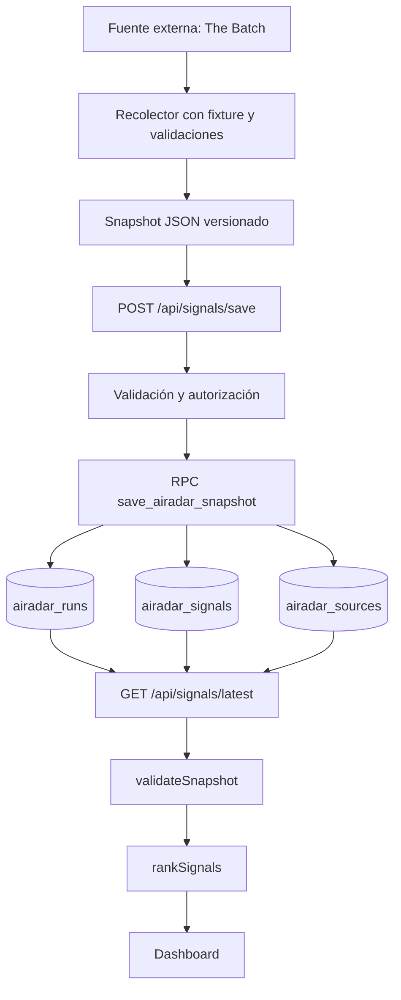

# Arquitectura de AI Radar

## Objetivo

AI Radar separa la recolección, el contrato de datos, la persistencia, la
lectura y la presentación. La separación permite probar el dominio sin
necesitar una conexión remota y evita que el navegador conozca credenciales de
Supabase.

## Componentes

| Componente | Ubicación | Responsabilidad |
| --- | --- | --- |
| Shell de frontend | `index.html`, `styles.css` | Estructura visual, estilos, accesibilidad y estados de interfaz. |
| Aplicación de navegador | `src/app.mjs` | Carga el snapshot, renderiza ranking y detalle, búsqueda y modo operador local. |
| Fuente de datos | `src/data-source.mjs` | Solicita `GET /api/signals/latest` y valida la respuesta. |
| Ranking | `src/ranking.mjs` | Calcula un puntaje determinista y ordena señales sin mutar el snapshot. |
| API de lectura | `api/signals/latest.js` | Lee el run más reciente de Supabase y lo transforma al contrato público. |
| API de escritura | `api/signals/save.js` | Autoriza, valida y guarda snapshots mediante RPC. |
| Autorización | `api/_lib/write-authorization.js` | Valida token estático u OIDC de Vercel para la escritura. |
| Persistencia | `supabase/airadar_persistence.sql` | Define tablas, restricciones, RLS y la transacción de guardado. |
| Recolección | `scripts/recopilar_the_batch.mjs` | Extrae ediciones de The Batch desde `__NEXT_DATA__`. |
| Herramientas locales | `scripts/consultar_senales.py`, `scripts/guardar_senales_airadar.py` | Consulta snapshots y los envía a la API. |

## Flujo de datos

### Escritura

1. Un snapshot local se valida antes de enviarse.
2. `POST /api/signals/save` rechaza métodos, credenciales o JSON inválidos.
3. La API valida fecha, búsqueda, señales, estados, confianza y URLs HTTP(S).
4. La RPC crea o actualiza el run, sus señales y sus fuentes en una operación.
5. Las claves solo existen en la función server-side o en el entorno de
   ejecución del script.

### Lectura

1. El frontend solicita `/api/signals/latest` al cargar.
2. La función obtiene el run más reciente por fecha y actualización.
3. Reconstruye el snapshot con señales y fuentes relacionadas.
4. El navegador vuelve a validar el contrato antes de renderizar.
5. El ranking se calcula localmente y no se guarda en Supabase.

## Límites actuales

- El modo operador guarda ajustes y ediciones únicamente en memoria del
  navegador.
- No existe fallback automático a `data/daily/` cuando Supabase no responde.
- La deduplicación está representada por una acción informativa, no por un
  algoritmo persistente.
- La API de lectura depende de `SUPABASE_URL` y de una clave server-side.
- No hay todavía CI ni un proceso programado de recolección versionado.

## Decisiones de seguridad

- El navegador conoce únicamente la ruta de lectura y el contrato público.
- Supabase mantiene RLS habilitado y revoca permisos a roles públicos.
- La escritura está separada de la lectura y exige autorización.
- Los errores devueltos al cliente son genéricos; los detalles técnicos solo se
  registran en el proceso server-side.
- `vercel.json` agrega CSP, `nosniff`, Referrer-Policy y Permissions-Policy.
